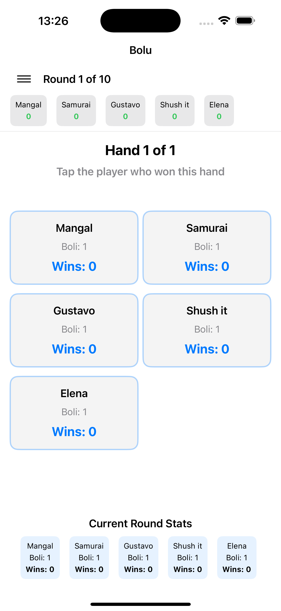
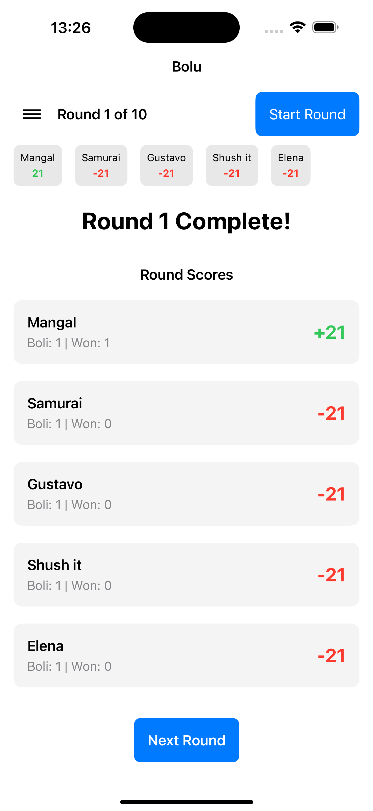
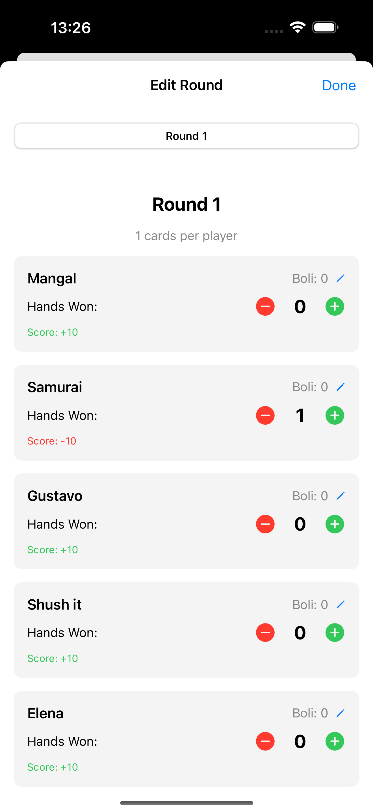

# 🎴 Bolu - Card Game iOS App

A fun and engaging card game app for iOS where players predict how many hands they'll win each round. Test your prediction skills and strategic thinking!


## 📱 Screenshots

<div align="center">
  <h3>Game View - Main Screen</h3>
  
  
  <h3>Boli Input - Declare Your Prediction</h3>
  
  
  <h3>Edit Round - Modify Past Rounds</h3>
  
</div>

## 🎮 What is Bolu?

Bolu is a card game where players predict (declare "Boli") how many hands they'll win in each round. The goal is to match your prediction exactly - if you predict correctly, you score positive points; if you're wrong, you score negative points. The player with the highest total score at the end wins!

## 🎯 How to Play

### Setup

1. **Start the App**: Launch Bolu on your iOS device
2. **Enter Players**: 
   - Enter the number of players (1-10)
   - Enter each player's name
   - Optionally reorder players to match seating arrangement
3. **Review Rounds**: The app automatically calculates how many rounds you'll play based on the number of players

### Gameplay

#### Round Structure

Each round follows this pattern:

1. **Card Distribution**
   - Round 1: 1 card per player
   - Round 2: 2 cards per player
   - Round 3: 3 cards per player
   - And so on...
   - Remaining cards are set aside (not used)

2. **Boli Declaration**
   - Starting from the first player, each player declares their Boli
   - Boli = how many hands you predict you'll win this round
   - Range: 0 to the number of cards per player
   - Use the ← → buttons to navigate between players if you need to correct a declaration

3. **Hand Play**
   - For each hand, all players throw one card
   - The best card wins the hand
   - Tap the player who won each hand
   - Continue until all hands are played

4. **Round Scoring**
   - Scores are calculated automatically
   - **Positive points**: If you won exactly the same number of hands as your Boli
   - **Negative points**: If you won more or fewer hands than your Boli

5. **Next Round**
   - Tap "Next Round" to continue
   - Repeat until all rounds are complete

### Winning

- The player with the **highest total score** at the end of all rounds wins
- Rankings are displayed in real-time throughout the game
- Final winner is announced with a celebratory animation!

## 📊 Scoring System

### Score Calculation

Your score for each round depends on whether you matched your Boli:

- **Exact Match**: You get **positive points**
- **Wrong**: You get **negative points** (same absolute value)

### Score Values

The score value is calculated based on your Boli declaration:

| Boli | Score Value |
|------|-------------|
| 0    | 10          |
| 1    | 21          |
| 2    | 32          |
| 3    | 43          |
| 4    | 54          |
| 5    | 65          |
| ...  | ...         |

**Formula**: `(Boli + 1) × 10 + Boli`

### Examples

- **Player declares Boli: 2, wins 2 hands** → Score: **+32** ✅
- **Player declares Boli: 2, wins 1 hand** → Score: **-32** ❌
- **Player declares Boli: 0, wins 0 hands** → Score: **+10** ✅
- **Player declares Boli: 3, wins 4 hands** → Score: **-43** ❌

## 🎮 App Features

### Core Features

- ✅ **Player Management**: Add 1-10 players with custom names
- ✅ **Round Management**: Automatic round calculation
- ✅ **Boli Declaration**: Easy-to-use picker interface
- ✅ **Hand Tracking**: Tap players to record hand winners
- ✅ **Real-time Scoring**: Automatic score calculation
- ✅ **Live Rankings**: See current standings throughout the game
- ✅ **Winner Announcement**: Animated winner celebration

### Advanced Features

- 🍔 **Hamburger Menu**: Quick access to game options
  - **New Game**: Start fresh anytime
  - **Edit Round**: Modify Boli and hands won for completed rounds
  - **End Game**: Finish early and declare winner
  - **Game History**: Browse past games

- ✏️ **Edit Functionality**
  - Edit hand wins for any completed round
  - Edit Boli declarations for any completed round
  - Automatic score recalculation

- 📜 **Game History**
  - View all past games
  - See winners, dates, and scores
  - Track your game statistics

- 🔄 **Navigation**
  - Navigate between players during Boli declaration
  - Correct mistakes easily

## 📋 Game Rules Summary

### Basic Rules

1. **Players**: 1-10 players
2. **Deck**: Standard 52-card deck
3. **Rounds**: `52 ÷ number of players` (rounded down)
4. **Cards per Round**: Increases by 1 each round (1, 2, 3, ...)
5. **Boli Range**: 0 to cards per player
6. **Scoring**: Positive if exact match, negative otherwise

### Important Notes

- Players can declare the same Boli (no restrictions)
- Remaining cards are set aside each round
- Boli always starts from the first player
- Scores accumulate across all rounds

## 🏆 Who Wins?

The player with the **highest total score** after all rounds wins!

- Scores can be positive or negative
- Total score = sum of all round scores
- Rankings update in real-time
- Final winner is clearly displayed

## 📱 How to Use the App

### Starting a Game

1. Launch the app
2. Enter number of players
3. Enter player names
4. Optionally edit player order
5. Tap "Start Game"

### During Gameplay

1. **Declare Boli**
   - Scroll the picker to select your Boli
   - Use ← → buttons to navigate between players
   - Tap "Confirm Boli" when done

2. **Record Hand Winners**
   - Tap the player who won each hand
   - Continue until all hands are played
   - View round results

3. **Continue to Next Round**
   - Review round scores
   - Tap "Next Round" to continue

### Using the Menu

Tap the ☰ (hamburger) icon in the top-left to access:

- **New Game**: Start a fresh game
- **Edit Round**: Modify past rounds
- **End Game**: Finish early
- **Game History**: View past games

### Editing Rounds

1. Open menu → "Edit Round"
2. Select the round to edit
3. **Edit Hands Won**: Use +/- buttons
4. **Edit Boli**: Tap pencil icon next to "Boli: X"
5. Scores update automatically

## 🛠️ Building and Installation

### Prerequisites

- **macOS** with Xcode 14.0 or later
- **iOS 14.0+** device or simulator
- **Apple Developer Account** (free or paid)

### Building from Source

1. **Clone the Repository**
   ```bash
   git clone https://github.com/yourusername/Bolu.git
   cd Bolu
   ```

2. **Open in Xcode**
   ```bash
   open Bolu.xcodeproj
   ```

3. **Configure Signing**
   - Select the **Bolu** project in Project Navigator
   - Select the **Bolu** target
   - Go to **Signing & Capabilities** tab
   - Check **"Automatically manage signing"**
   - Select your **Team**

4. **Build and Run**
   - Select a simulator or connected device
   - Press `Cmd + R` or click the Play button

### Installing on Physical Device

See [DEPLOY_TO_DEVICE.md](DEPLOY_TO_DEVICE.md) for detailed instructions.

**Quick Steps:**
1. Connect your iPhone/iPad via USB
2. Select your device in Xcode
3. Build and run (`Cmd + R`)
4. Trust the developer certificate on your device (Settings → General → VPN & Device Management)

### Pre-built App

**Note on Distribution:**

iOS apps require code signing for installation. There are several options:

1. **Build from Source** (Recommended)
   - Clone the repo and build in Xcode
   - Works with free Apple Developer account
   - See [DEPLOY_TO_DEVICE.md](DEPLOY_TO_DEVICE.md) for details

2. **TestFlight** (Beta Testing)
   - Requires paid Apple Developer account ($99/year)
   - Upload build to App Store Connect
   - Invite testers via TestFlight app

3. **App Store** (Public Release)
   - Requires paid Apple Developer account
   - Submit through App Store Connect
   - Available to all iOS users

4. **Direct Installation**
   - Build in Xcode and install via USB
   - Requires Apple Developer account (free or paid)
   - Apps expire after 7 days (free account) or 1 year (paid account)

**Why no pre-built .ipa file?**
- iOS apps must be signed with your Apple Developer certificate
- Each installation requires the developer's certificate
- For security, Apple doesn't allow unsigned app distribution

## 📁 Project Structure

```
Bolu/
├── Bolu/
│   ├── App/                    # App entry point
│   │   ├── BoluApp.swift
│   │   └── ContentView.swift
│   ├── Models/                  # Data models
│   │   ├── Player.swift
│   │   ├── Game.swift
│   │   ├── Round.swift
│   │   └── GameHistory.swift
│   ├── ViewModels/             # Business logic
│   │   └── GameViewModel.swift
│   ├── Views/                  # UI components
│   │   ├── Setup/
│   │   ├── Game/
│   │   ├── Results/
│   │   ├── Edit/
│   │   ├── History/
│   │   └── Menu/
│   └── Utilities/              # Helper utilities
│       ├── ScoreCalculator.swift
│       ├── GameHistoryStore.swift
│       ├── Constants.swift
│       └── ButtonStyles.swift
├── Documentation/
│   ├── GAME_DESIGN.md
│   ├── IMPLEMENTATION_PLAN.md
│   └── DEPLOY_TO_DEVICE.md
└── README.md
```

## 🧪 Testing

### Manual Testing Checklist

- [ ] Setup: Add players and verify round calculation
- [ ] Boli Declaration: Declare Boli for all players
- [ ] Navigation: Use ← → buttons to navigate between players
- [ ] Hand Tracking: Record hand winners correctly
- [ ] Scoring: Verify scores match expected values
- [ ] Edit Round: Edit Boli and hands won
- [ ] Menu: Test all menu options
- [ ] Game History: Verify games are saved
- [ ] Multiple Rounds: Complete full game
- [ ] Winner: Verify winner announcement

## 🐛 Troubleshooting

### Common Issues

**Build Errors:**
- Clean build folder: `Cmd + Shift + K`
- Verify all files are added to target
- Check minimum iOS version (14.0)

**Simulator Issues:**
- Restart simulator
- Try different simulator model
- Check available simulators: `xcrun simctl list devices`

**Device Installation:**
- Trust developer certificate in Settings
- Check device is unlocked
- Verify USB connection

## 🤝 Contributing

Contributions are welcome! Please feel free to submit a Pull Request.

1. Fork the repository
2. Create your feature branch (`git checkout -b feature/AmazingFeature`)
3. Commit your changes (`git commit -m 'Add some AmazingFeature'`)
4. Push to the branch (`git push origin feature/AmazingFeature`)
5. Open a Pull Request

## 📝 License

This project is licensed under the MIT License - see the LICENSE file for details.

## 👨‍💻 Author

**Your Name**
- GitHub: [@yourusername](https://github.com/yourusername)

## 🙏 Acknowledgments

- Built with SwiftUI
- Designed for iOS 14+
- Inspired by traditional card games

## 📞 Support

If you encounter any issues or have questions:
- Open an issue on GitHub
- Check the documentation files
- Review the troubleshooting section

---

**Enjoy playing Bolu! 🎴🎉**
